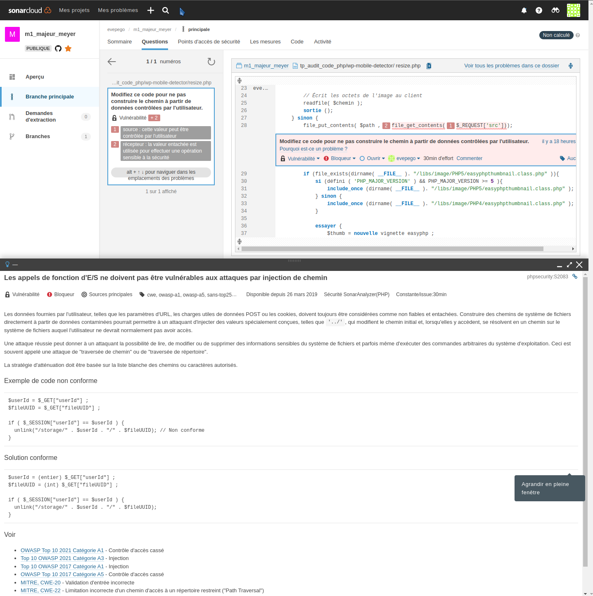

# m1_majeur_meyer
TP Audit de code PHP

## Recherche des points d'entrées de l'application :
 
> **En règle générale, quels sont les points d'entrée vers le code d'une application web ?**  
Les points d'entrée principaux d'une application web sont dans le fichier `fichier.xml` et dans les requêtes pour transmettre des paramètres à l'application web (`GET`, `POST`, `REQUEST`, etc.)  
**Nom de l'étape :** `Ground Zero`

### Script
```python3
from collections import defaultdict
import glob
from itertools import count
from unittest import result

* 
http_requests = ['$_GET', '$_POST', '$_REQUEST']

dir = ['./wp-mobile-detector/*.php', './wp-mobile-detector/*/*.php', './wp-mobile-detector/*/*/*.php', './wp-mobile-detector/*/*/*/*.php', './wp-mobile-detector/*/*/*/*/*.php', './wp-mobile-detector/*/*/*/*/*/*.php']

def occurence1(string_list):
    results =  defaultdict(int)
    count = 0
    for d in dir:
        for file_name in glob.iglob(d):
            with open(file_name) as input_file:
                for line in input_file:
                    for s in string_list:
                        if s in line:
                            print(file_name)
                            results[s] += 1
                            count += 1
    return results, count

print(occurence1(http_requests), count)
```

### Sortie

```bash
eve@Evux:~/m1_majeur_meyer/tp_audit_code_php$ python3 script1.py 
./wp-mobile-detector/resize.php
./wp-mobile-detector/resize.php
./wp-mobile-detector/resize.php
./wp-mobile-detector/resize.php
./wp-mobile-detector/functions.php
./wp-mobile-detector/functions.php
./wp-mobile-detector/functions.php
./wp-mobile-detector/functions.php
./wp-mobile-detector/functions.php
./wp-mobile-detector/websitez-wp-mobile-detector.php
./wp-mobile-detector/admin/themes.php
./wp-mobile-detector/admin/themes.php
./wp-mobile-detector/admin/themes.php
./wp-mobile-detector/admin/themes.php
./wp-mobile-detector/admin/themes.php
./wp-mobile-detector/admin/themes.php
./wp-mobile-detector/admin/themes.php
./wp-mobile-detector/admin/themes.php
./wp-mobile-detector/admin/themes.php
./wp-mobile-detector/admin/themes.php
./wp-mobile-detector/admin/themes.php
./wp-mobile-detector/admin/themes.php
./wp-mobile-detector/admin/themes.php
./wp-mobile-detector/admin/themes.php
./wp-mobile-detector/admin/themes.php
./wp-mobile-detector/admin/themes.php
./wp-mobile-detector/admin/themes.php
./wp-mobile-detector/admin/themes.php
./wp-mobile-detector/admin/themes.php
./wp-mobile-detector/admin/themes.php
./wp-mobile-detector/admin/themes.php
./wp-mobile-detector/admin/themes.php
./wp-mobile-detector/admin/themes.php
./wp-mobile-detector/admin/upgrade.php
./wp-mobile-detector/admin/upgrade.php
./wp-mobile-detector/admin/upgrade.php
./wp-mobile-detector/admin/upgrade.php
./wp-mobile-detector/admin/admin-page.php
./wp-mobile-detector/admin/admin-page.php
./wp-mobile-detector/admin/admin-page.php
./wp-mobile-detector/admin/admin-page.php
./wp-mobile-detector/admin/admin-page.php
./wp-mobile-detector/js/sharing.php
./wp-mobile-detector/js/sharing.php
./wp-mobile-detector/themes/amanda-mobile/style.php
./wp-mobile-detector/themes/jester-mobile/search.php
./wp-mobile-detector/themes/bluesteel-mobile/search.php
./wp-mobile-detector/themes/wz-mobile/style.php
./wp-mobile-detector/themes/websitez-mobile/search.php
./wp-mobile-detector/themes/websitez-mobile/style.php
./wp-mobile-detector/themes/corporate-mobile/search.php
./wp-mobile-detector/themes/corporate-mobile/style.php
./wp-mobile-detector/themes/corporate-mobile/twitter.php
./wp-mobile-detector/themes/corporate-mobile/twitter.php
(defaultdict(<class 'int'>, {'$_REQUEST': 8, '$_GET': 31, '$_POST': 15}), 54) <class 'itertools.count'>
```

## Analyse des résultats retournés par le script :

## Analyse statique à l'aide d'un outil dédié :


## Prise de contrôle du serveur web :
